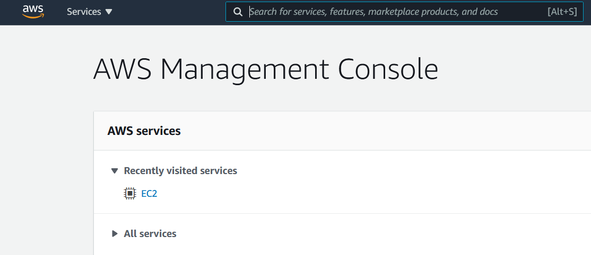
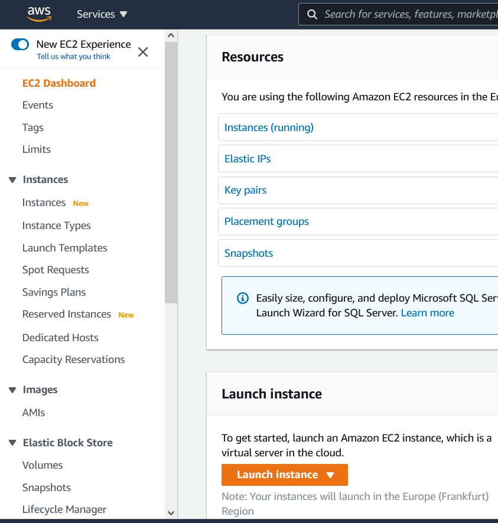
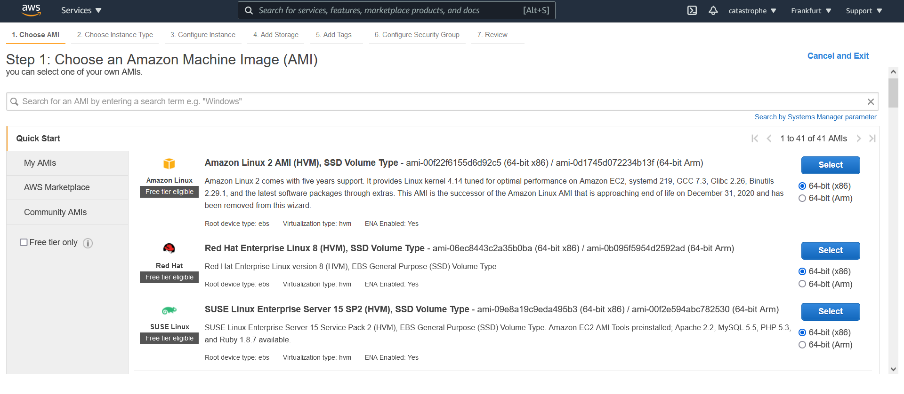
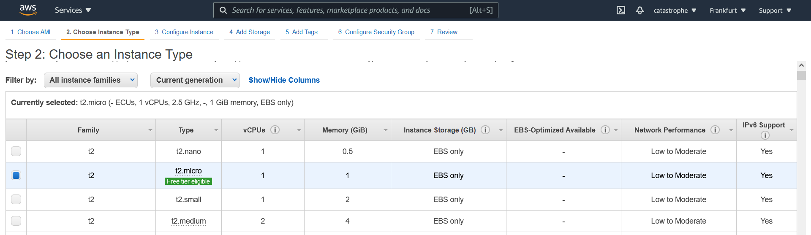
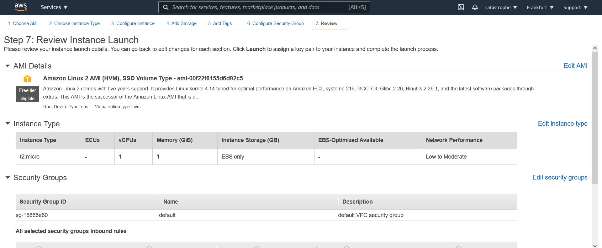

# Elastic Computing Cloud

Elastic Computing Cloud veya yaygın adıyla EC2 Amazon'un yeniden boyutlandırılabilir hesaplama hizmetleri sunan web servisine verdiği isimdir.
Elastic kelimesinin bir çok sebebi var ve kullandıkça görebilirsiniz. Temel özelliklerinden biraz bahsedelim.

EC2 size pek çok farklı kombinasyonla kullanabileceğiniz, genel kullanım amacı taşıyan sanal sunucular temin eder. Sunucu temin hızı dakikalar ile sınırlı olduğu için kurduğunuz yapıyı yeniden şekillendirmeniz veya sunucularınızı up-down sürecine dahil etmeniz kısa sürecektir.
Bu kombinasyonların temel başlıkları arasında CPU veya RAM miktarı, kullanılacak işletim sistemi tipi veya ek yazılımlar gibi bir çok çeşitlilik vardır.
Farklı veri merkezlerinde tutabileceğiniz verilerinizin düzenli olarak sistemsel yedeklerinin alınmasını isteyebilir ve veri açısından fail-over bir yapı kurma yolunda ilk adımları atabilirsiniz.
Kurduğunuz ünitelerin her biri statik bir IP adresi üzerinden erişilebilir olacaktır ve siz üniteyi kapatana kadar bu IP adresini koruyacaktır. Bir çoğu "hesaplama" öncelikli kurulum senaryosunda IP üzerinden erişim ciddi bir sorun teşkil etmese de yukarıda bahsettiğim veri yedekleme ve çeşitli kaynak kombinasyonlarına sahip olma özellikleri ile EC2, bulut bilişime yeni bir bakış açısı kazandıracaktır.

## Napolyon ?

EC2 üniteleri (instances) 4 farklı tipi (ödeme metodu) ile erişilebilir haldedir. Bunlar sırasıyla On-demand, Reserved, Spot ve DedicatedHost şeklindedir. İnceleyecek olursak,

- On-Demand: Amazon'un saatlik ve hatta dakikalık olarak faturalandırdığı üniteler. Burada ünitelerinizi kolaylıkla çoğaltabildiğinizi ve bir üyelik sözü veya ön ödeme gerekmediğini belirtebiliriz. Test ortamı olarak kullanmak, EKS servisi için node gücü olarak kullanmak gibi sebepler ile kullanılması mümkündür ve saatlik olarak faturalandırıldığınız için bu üniteler üzerindeki işlemlerden siz sorumlusunuzdur. Bir uygulamanızın veya çözümünüzün AWS geçişini sağlamak için ilk adımınız buraya adım atmak olacaktır çünkü düşük ücretler ile küçük ünite kullanımları sağlayabilir ve yazılım testlerinizi kolaylıkla koşabilirsiniz. AWS üzerinde kuracağınız yapıda yapacağınız ilk değişimler böylece ilk işaretlerini gösterebilir.

- Reserved: Reserved ünitelere ön ödeme yapılır ve sonrasında taksitli bir şekilde ödemeler devam eder. Bu süre zarfından önden anlaşılan makine rezervleri sabit olarak tutulur ve take-it-or-leave-it metodolojisi ile çalışır. Yani önden ödeme yaptığınız ve kullanım taahhüdü verdiğiniz üniteleri kullanmanız veya kullanmamanız sizin seçiminizdir. Taahhüt ettiğiniz miktarı ödemeye devam edersiniz. Örnek olarak, elinizde 2 CPU ve 4GB RAM sahibi bir ünite var (Bu ünite genel kullanım için optimize edildi ise muhtemelen t2.medium tipinde olacaktır). Bu ünite için önden bir miktar ücret ödemiş ve belirli bir süre aylık periyotlarla ücret ödeyeceğinizi taahhüt ettini. Taahhüt süreniz boyunca, kiraladığınız miktarın size yeteceğine eminseniz, doğru bir karar verdiniz çünkü Reserved üniteler normale kıyasla yüzde 70'e kadar daha uygun fiyatlı olabiliyor. Burada ortalama aylık ödemeniz için belirli bir sınırın üzerine çıkamayacağınızın yanı sıra aklınızda bulunması gereken bir diğer şey ise, daha fazla ünite için söz verirseniz indirim seviyeniz artmaktadır.

- Spot: Bu tip üniteler talep görmeyen instance değerlerinin serbest piyasa usulü değer kaybetmesi ile daha uygun fiyatlara mal edilmesiyle (borsa usulü) ortaya çıkar ve On-demand'a kıyasla bir hayli hesaplıdır. Tabii ki de burada da bir dezavantaj bulunmakta. Spot instance kullanarak Amazon'a belirli bir süre önceden sizin uyarılmanız koşuluyla ya istenen ücreti ödeyeceğinizi ya da Amazon'un bu üniteyi geri alabileceğini kabul etmiş olursunuz. Eğer bu üniteyi Amazon sizden geri istedikten sonra kapatırsa 5 saat 46 dakikalık kullanım sonunda 5 saat ücreti ödersiniz. Ancak 5 saat 3 dakikalık kullanım sonrasında siz kaaptırsanız 6 saatlik ücret ödersiniz. Kullanımı sırasında aklınızda tutmanız gerekebilen bir diğer nokta da bu olacaktır.

- DedicatedHost: Adından da anlaşılacağı gibi sanal makinelerden fiziki sunuculara geçiş yapıyoruz ve tek sunucu desteği olan lisanslar veya devlet zorunluluğu taşıyan projeler için kullanılabilen ünitelere geliyoruz. Burada ödeme yönteminiz değişiklik gösterebilir ve asıl önemli olan nokta bir önceki cümlededir.

## Aman aman hemen Free Tier bakalım !

AWS üzerinde login olduğunuzda ya arama kısmından ya da önerilen servisler listesinden EC2 servisini seçin.

Sayfanın sol tarafı şekildeki gibi olacaktır. Alt kısımda yer alan "Launch instance" butonu ile ilk On-demand ünitenizi oluşturabilirsiniz.

Butona tıklayalım ve devam edelim. Amazon Machine Image bizim için Amazon tarafından özelleştirilmiş işletim sistemi imajlarından oluşan bir listeden istediğimiz imajı seçmemize olanak sağlar. Burada genellikle ilk tercih bildiğimiz bir dağıtım olacaktır ancak battı balık diyip Amazon Linux 2 imajını seçebilirsiniz.

Instance type seçimine ilerlediğimizde görüyoruz ki daha önce bahsettiğim CPU ve RAM kombinasyonlarından, "Instance family" başlığı altındaki özelleştirmelere kadar bir çok kombinasyon bulunmakta. Tabii ki "Free Tier eligible" etiketi olan 1 vCPU ve 1GB RAM sahibi T serisi 2. nesil micro üniteyi seçiyoruz. Önceki cümlede "T serisi 2. nesil" dememin sebebi Amazon'un ünitelerini kullanım tarzlarına göre bölerken genellikle tek harfli kodlar kullanması ve jenerasyonları sayı ile göstererek ilerlemesi. Bu küçük bilgi de belki ileride işimize yarar :)

Hemen ardından, henüz VPC veya SecurityGroups konusuna değinmediğimiz için sağ alttaki "Review and Launch" butonuna basıyoruz ve sunucu bağlantısı için ufak bir pop up çıkıyor. Burada sunucu erişimi için bir pem dosyası oluşturabilir veya dosya kullanmamayı seçebilirsiniz. Amazon ünitenize bağlanmak ve ssh anahtarı eklemek için size bir web arayüzü vererek terminal erişimi sağlayabilmektedir.

Ve büyük finalde eski ünitemin hemen altında yeni bir ünite can buluyor ve "Initializing" durumunda olduğunu görebiliyoruz. 

Initializing durumundan Running durumuna geçmesi yaklaşık 1 dakika süren bu ünitenin kurulum kararları da yaklaşık 1 dakika sürmüştü. Bu durumda artık "Sanal makine kurmak ve kullanmak 2 dakikalık iş" desem yalan söylemiş olmam.

Kurulumu ve kullanımı bu kadar basit bir servis olan EC2 özelinde daha bir çok yazı fikrim ve sebebim var. Umarım severek okuyacağınız bir yazı serisi çıkarabilirim.
