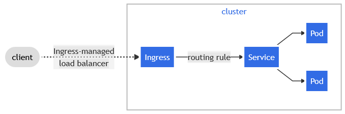

# Ingress



Ingress, kubernetes üzerinde çalışan servislere dışarıdan gelebilecek trafiği yönlendirdiğimiz 
ve belirli yönlendirme kararları alabildiğimiz yapıdır.

Ingress yapılandırmasında akılda tutulması gereken şey, Ingress kullanırken bir de 
IngressController servisine ihtiyaç duyduğunuzdur.

Ingress servislerinin kullanıma hazır yaml dosyalarına birçok farklı kaynaktan erişebilirsiniz.
Yine de her dosyada yaptığım gibi burada da kubernetes.io üzerinden bir örnek vermeme izin verin lütfen.

```
apiVersion: networking.k8s.io/v1
kind: Ingress
metadata:
  name: minimal-ingress
  annotations:
    nginx.ingress.kubernetes.io/rewrite-target: /
spec:
  rules:
  - http:
      paths:
      - path: /testpath
        pathType: Prefix
        backend:
          service:
            name: test
            port:
              number: 80
```

Burada gördüğümüz ingress servisi normal şartlar altında (Pre-prod ve prod ortamlarında) spec alanında bir de 'host'
alanıyla karşımızda olacaktı. Burada bulunan tanıma göre cluster üzerine gelen tüm HTTP trafiği test isimli servise akacaktır.

Farklı IngressController servisleri için farklı 'annotation' alanları farklı tiplerdeki kubernetes yapılarını tanımlamamız mümkün olacaktır.
Örnek olarak Istio servisi virtualService ve Gateway tanımlarıyla ve bir LoadBalancer servis ile çalışabilmektedir.

### Host

Yukarıda örneği verilen Ingress servisi gelen HTTP trafiğini test isimli servise aktarırken aşağıdaki Ingress tanımının biraz daha farklı 
davrandığını görebilirsiniz sanırım.

```
apiVersion: networking.k8s.io/v1
kind: Ingress
metadata:
  name: ingress-with-host
spec:
  rules:
  - host: "foo.bar.com"
    http:
      paths:
      - pathType: Prefix
        path: "/bar"
        backend:
          service:
            name: service1
            port:
              number: 80
```

Aralarındaki fark rules kısmından sonra gelen host tanımına dikkat edin. Belirli bir host için cluster içine akan HTTP trafiğini
service1 isimli servise aktarıyor. Artık domain'ler de hayatımızın bir parçası haline gelebilir böylece.

Domain satın alma işlemlerine değinmeyeceğim ancak eğer daha önce internetin nasıl çalıştığını veya bir domain'in 
bir server üzerinden nasıl hizmet verdiğini biliyorsanız buradaki durumu kolayca anlamışsınızdır.

```
apiVersion: networking.k8s.io/v1
kind: Ingress
metadata:
  name: ingress-wildcard-host
spec:
  rules:
  - host: "*.foo.com"
    http:
      paths:
      - pathType: Prefix
        path: "/foo"
        backend:
          service:
            name: service2
            port:
              number: 80
```

'kind: Ingress' tanımına sahip bu konfigürasyonda ise birden çok domain tanımı bulunmakta ancak bu durumun sebebi 
wildcard domain kullanımıdır. Özetle, adana.foo.com veya bursa.foo.com adreslerine gelen HTTP trafiği 
eğer '/foo' uzantısına sahipse, bu kubernetes cluster'ına gelirse iki adres de service2 tarafından karşılanacak.

### TLS

Bir ingress servisini TLS ile daha güvenli bir hale getirebilirsiniz. Bunun için bir TLS secret'ı tanımlamanız gerekmektedir. 
TLS secret tanımında TLS için kullandığınız crt ve key dosyanız bulunmalı ve örneklerini internette tonlarca bulabilirsiniz.
Ama ben yine de buraya ekleyeceğim :)

```
apiVersion: v1
kind: Secret
metadata:
  name: testsecret-tls
  namespace: default
data:
  tls.crt: base64 encoded cert
  tls.key: base64 encoded key
type: kubernetes.io/tls
```

Burada tanımladığımız secret, type alanı üzerinden bir TLS secret olduğunu belli edebiliyor ancak bu secret ile 
Ingress servisini nasıl entegre edeceğiz soru akıllardaki yerini koruyabilir. Bu sorunun cevabı da TLS secret gibi kolay. Bakınız...

```
apiVersion: networking.k8s.io/v1
kind: Ingress
metadata:
  name: tls-example-ingress
spec:
  tls:
  - hosts:
      - example.foo.com
    secretName: testsecret-tls
  rules:
  - host: https-example.foo.com
    http:
      paths:
      - path: /
        pathType: Prefix
        backend:
          service:
            name: service1
            port:
              number: 80
```
Belirtmem gerekiyor ki, bu örnekler çok temel ve inanıyorum ki işinize çok yarayacaktır.

### Load Balancing

Yük dengeleme Ingress servisleri için bootstrapped (gömülü) şekilde kullanılmaktadır ancak isteğe bağlı olarak 
farklı Ingress controller vb. kaynaklar kullanılarak yük dengeleme işlemi yapılabilir ve yük dengeleme protokolleri değiştirilebilir.